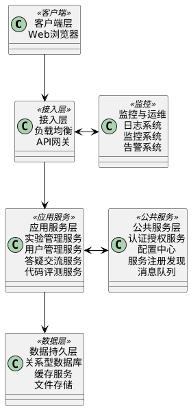

# 软件概要设计说明书

[Toc]

## 1 引言

### 1.1 编写目的

本概要设计说明书的目的是描述"灵狐智验"在线实验平台系统的整体架构设计、系统模块划分、接口设计和数据结构设计等内容，为后续的详细设计和系统实现提供基础和指导。

本文档面向的读者包括：
- 项目开发团队成员：为详细设计和编码实现提供指导
- 测试团队成员：了解系统架构和功能设计，制定测试策略
- 项目管理人员：监督和控制开发过程，确保系统质量
- 相关技术人员：了解系统设计思路和架构特点

### 1.2 背景

#### 1.2.1 软件系统名称

本文档适用于"灵狐智验"在线实验平台系统，版本号为V1.0。

#### 1.2.2 任务来源与开发者

- 任务提出者：魔法学院教务处
- 开发者：代码狐工作室
- 用户：魔法学院师生
- 运行平台：魔法学院云服务器中心

### 1.3 定义

| 术语 | 定义 |
|------|------|
| 前端 | 面向用户的界面部分，包括Web页面、交互组件等 |
| 后端 | 提供业务逻辑和数据处理的服务器端程序 |
| API | Application Programming Interface，应用程序编程接口 |
| MVC | Model-View-Controller，一种软件设计模式 |
| ORM | Object-Relational Mapping，对象关系映射 |
| REST | Representational State Transfer，一种网络应用程序的设计风格 |
| JWT | JSON Web Token，用于身份验证的开放标准 |
| RBAC | Role-Based Access Control，基于角色的访问控制 |

### 1.4 参考设计

## 2 系统需求概述

### 2.1 需求规定

根据《软件需求规格说明书》，"灵狐智验"在线实验平台系统的主要需求如下：

1. **实验管理功能**：支持教师创建、发布实验，学生进行在线实验提交与自动评测
2. **用户管理功能**：支持用户身份认证、角色权限管理、个人信息维护
3. **答疑交流功能**：支持师生之间的线上交流与答疑
4. **代码评测功能**：支持代码在线编辑、自动评测与结果分析

系统需要满足高可靠性、高安全性和良好的用户体验。同时，系统需要支持至少1000名用户同时在线，并能迅速响应用户请求。

### 2.2 业务目标

"灵狐智验"在线实验平台系统的业务目标如下：

1. **解决现有系统痛点**：解决代码提交丢失、操作不便等问题，提升教学效率
2. **提高教学质量**：通过自动化评测和实时反馈，提高实验教学质量
3. **优化师生互动**：建立便捷的师生交流渠道，促进教学互动
4. **保障数据安全**：确保教学数据的安全存储和隐私保护
5. **提供稳定服务**：提供7*24小时稳定的实验平台服务

### 2.3 运行环境

#### 2.3.1 设备

**服务器端：**
- 处理器：8核处理器，主频2.5GHz以上
- 内存：32GB RAM
- 存储：系统盘SSD 200GB，数据盘1TB
- 网络：千兆以太网接口，支持高并发连接

**客户端：**
- 支持各类PC、笔记本电脑
- 处理器：双核处理器，主频1.8GHz以上
- 内存：4GB RAM以上
- 网络：支持稳定的互联网连接，带宽不低于10Mbps

#### 2.3.2 支持软件

**服务器端：**
- 操作系统：Ubuntu Server 20.04 LTS
- Web服务器：Nginx 1.18+
- 数据库：MySQL 8.0+
- 运行时环境：
  - Node.js 16+
  - Java JDK 17+
  - Docker 20.10+
  - Redis 6.0+

**客户端：**
- 操作系统：Windows 10+、macOS 10.15+、主流Linux发行版
- 浏览器：Chrome 88+、Firefox 85+、Edge 88+、Safari 14+
- 插件要求：支持JavaScript ES6+、WebSocket、HTML5、CSS3

### 2.4 设计约束

在系统设计过程中，需考虑以下约束条件：

1. **技术约束**：
   - 采用主流Web开发技术，确保系统兼容性和可维护性
   - 前端使用响应式设计，兼容不同设备和屏幕尺寸
   - 后端采用RESTful API设计，支持前后端分离架构

2. **安全约束**：
   - 符合教育数据隐私保护要求
   - 实现基于角色的访问控制
   - 所有通信采用HTTPS加密传输
   - 敏感数据采用强加密存储

3. **性能约束**：
   - 普通操作响应时间不超过2秒
   - 代码评测操作响应时间不超过30秒
   - 系统支持至少1000名用户同时在线
   - 服务可用性达到99.9%

4. **兼容性约束**：
   - 支持主流Web浏览器
   - 遵循Web标准，确保跨平台兼容性
   - 符合WAI-ARIA可访问性标准

### 2.5 功能需求

#### 2.5.1 总体功能结构

"灵狐智验"在线实验平台系统的功能结构划分为四个子系统，如下图所示：


#### 2.5.2 核心处理流程

系统的核心处理流程如下：

1. **实验创建流程**：
   - 教师登录系统
   - 创建实验并设计实验内容
   - 配置评测标准
   - 上传实验资源
   - 保存实验

2. **实验发布流程**：
   - 教师选择已创建的实验
   - 设置开始和截止时间
   - 分配学生或小组
   - 发布实验
   - 通知学生

3. **实验执行流程**：
   - 学生登录系统
   - 查看可用实验
   - 访问实验内容
   - 完成实验任务
   - 提交实验答案
   - 接收自动评测结果

4. **评测反馈流程**：
   - 接收学生提交内容
   - 执行自动评测
   - 生成评测结果
   - 反馈给学生
   - 记录评测历史
   - 统计分析成绩

### 2.6 非功能需求

#### 2.6.1 性能需求

1. **响应时间**：
   - 页面加载时间不超过3秒
   - 普通操作响应时间不超过2秒
   - 代码评测操作响应时间不超过30秒

2. **并发能力**：
   - 支持1000名用户同时在线
   - 高峰期服务器CPU使用率不超过70%
   - 高峰期内存使用率不超过80%

3. **可扩展性**：
   - 支持水平扩展，增加服务器节点提升系统容量
   - 支持功能模块的独立扩展和升级

#### 2.6.2 安全需求

1. **身份认证**：
   - 采用多因素认证机制
   - 实现基于JWT的token认证
   - 支持与学校统一身份认证系统对接

2. **数据加密**：
   - 传输数据采用TLS 1.2+加密
   - 敏感数据采用AES-256加密存储
   - 密码采用bcrypt等强哈希算法存储

3. **访问控制**：
   - 实现基于角色的访问控制（RBAC）
   - 细粒度的权限控制机制
   - 操作日志审计功能

#### 2.6.3 可靠性需求

1. **可用性**：
   - 系统年可用性达到99.9%
   - 平均无故障运行时间(MTBF)不低于500小时
   - 关键功能具备降级服务能力

2. **数据备份与恢复**：
   - 每日全量备份、每小时增量备份
   - 数据恢复时间不超过4小时
   - 支持实验进度自动保存与恢复

3. **容错能力**：
   - 服务器单点故障不影响整体系统可用性
   - 自动检测并恢复异常状态
   - 防网络波动导致的数据丢失机制

### 2.7 系统总体架构

#### 2.7.1 架构设计原则

"灵狐智验"在线实验平台系统的架构设计遵循以下原则：

1. **分层设计**：采用经典的分层架构，实现关注点分离
2. **前后端分离**：前端和后端独立开发，通过API进行交互
3. **模块化**：系统按功能划分为多个模块，降低耦合度
4. **可扩展性**：支持水平扩展，满足并发需求
5. **安全性**：遵循安全开发最佳实践，保障数据安全
6. **可维护性**：清晰的代码结构和文档，便于后期维护

#### 2.7.2 系统架构图

"灵狐智验"在线实验平台系统采用基于微服务的分布式架构，总体架构如下图所示：


#### 2.7.3 技术架构选型

基于系统需求和架构设计，技术栈选型如下：

1. **前端技术**：
   - 框架：Vue 3
   - UI组件库：Element Plus
   - 状态管理：Pinia
   - 路由管理：Vue Router
   - 构建工具：Vite

2. **后端技术**：
   - 主框架：Spring Boot
   - 微服务框架：Spring Cloud
   - ORM框架：MyBatis
   - API文档：Swagger
   - 安全框架：Spring Security

3. **数据存储**：
   - 关系数据库：MySQL
   - 缓存：Redis
   - 文件存储：MinIO
   - 搜索引擎：Elasticsearch

4. **DevOps工具**：
   - 容器化：Docker
   - 容器编排：Kubernetes
   - CI/CD：Jenkins
   - 监控：Prometheus + Grafana
   - 日志收集：ELK Stack

## 3 系统接口设计

### 3.1 接口设计原则

"灵狐智验"在线实验平台系统的接口设计遵循以下原则：

1. **统一性**：接口风格保持一致，便于开发和维护
2. **简洁性**：接口设计简洁明了，易于理解和使用
3. **安全性**：保证接口的安全访问，防止未授权调用
4. **可扩展性**：接口设计预留扩展空间，便于功能升级
5. **规范化**：遵循RESTful API设计规范
6. **文档化**：提供完整的接口文档和示例

### 3.2 接口设计

#### 3.2.1 用户接口

"灵狐智验"在线实验平台系统提供Web界面作为用户接口，主要包括以下几类页面：

1. **登录与注册界面**
   - 登录表单：用户名/密码输入框、验证码显示区、登录按钮
   - 注册表单：用户基本信息输入区、验证码显示区、注册按钮
   - 密码找回：邮箱/手机号输入区、验证码发送和输入区

2. **教师端界面**
   - 实验管理：实验列表、实验创建/编辑表单、实验状态显示区
   - 学生管理：学生列表、分组管理、成绩统计图表
   - 资源管理：资源上传区、文件列表、预览区
   - 评测管理：评测标准设置表单、测试用例管理

3. **学生端界面**
   - 实验列表：可用实验列表、实验状态显示、截止时间提示
   - 实验操作：实验内容显示区、任务操作区、进度显示条
   - 代码编辑：在线代码编辑器、文件浏览器、运行与提交按钮
   - 成绩查看：评测结果显示区、历史提交记录、成绩统计图表

4. **通用功能界面**
   - 个人信息：用户信息显示与编辑表单
   - 消息通知：通知列表、标记已读按钮、消息详情弹窗
   - 帮助文档：分类导航、搜索框、内容显示区
   - 系统设置：主题切换、字体大小调整、界面语言选择

用户界面设计将采用响应式布局，适配不同屏幕尺寸的设备。界面操作流程符合用户习惯，通过清晰的视觉提示和操作反馈增强用户体验。

#### 3.2.2 外部接口

##### 3.2.2.1 软件接口

1. **身份认证接口**
   - 接口名称：UnifiedAuthService
   - 接口描述：与学校统一身份认证系统对接
   - 调用方向：本系统 → 学校身份认证系统
   - 接口协议：OAuth 2.0
   - 主要功能：
     - 用户登录认证
     - 用户基本信息获取
     - 用户权限验证

2. **教务系统接口**
   - 接口名称：AcademicService
   - 接口描述：与学校教务系统对接，获取课程、班级和学生信息
   - 调用方向：本系统 → 教务系统
   - 接口协议：RESTful API
   - 主要功能：
     - 获取课程列表
     - 获取班级学生名单
     - 同步成绩数据

3. **邮件服务接口**
   - 接口名称：MailService
   - 接口描述：发送系统通知和提醒邮件
   - 调用方向：本系统 → 邮件服务器
   - 接口协议：SMTP
   - 主要功能：
     - 发送实验发布通知
     - 发送截止日期提醒
     - 发送成绩公布通知

4. **短信服务接口**
   - 接口名称：SMSService
   - 接口描述：发送手机短信通知
   - 调用方向：本系统 → 短信服务提供商
   - 接口协议：HTTP/HTTPS API
   - 主要功能：
     - 发送验证码
     - 发送重要通知提醒

##### 3.2.2.2 硬件接口

系统主要为Web应用，不直接与特定硬件交互，但需要在以下方面考虑硬件兼容性：

1. **显示适配**
   - 支持不同分辨率和屏幕尺寸的显示设备
   - 支持触摸屏操作和鼠标键盘操作
   - 支持不同显示比例（16:9、16:10、4:3等）

2. **网络连接**
   - 适应不同网络环境（有线、无线、4G/5G移动网络）
   - 针对网络延迟和不稳定情况进行优化
   - 支持断点续传和断线重连

#### 3.2.3 内部接口

系统内部各模块间通过定义的服务接口进行通信，主要接口如下：

##### 3.2.3.1 用户服务接口

```
接口名称：UserService
接口描述：提供用户管理相关功能
主要方法：
- authenticate(username, password): 用户认证
- getUserInfo(userId): 获取用户信息 
- updateUserInfo(userInfo): 更新用户信息
- getRolePermissions(roleId): 获取角色权限
```

##### 3.2.3.2 实验管理接口

```
接口名称：ExperimentService
接口描述：提供实验管理相关功能
主要方法：
- createExperiment(experimentInfo): 创建实验
- publishExperiment(experimentId, settings): 发布实验
- getExperimentList(filters): 获取实验列表
- getExperimentDetail(experimentId): 获取实验详情
```

##### 3.2.3.3 评测服务接口

```
接口名称：EvaluationService
接口描述：提供代码评测相关功能
主要方法：
- submitCode(submissionInfo): 提交代码
- evaluate(submissionId): 评测代码
- getEvaluationResult(submissionId): 获取评测结果
- saveEvaluationCase(caseInfo): 保存评测用例
```

##### 3.2.3.4 答疑服务接口

```
接口名称：ForumService
接口描述：提供答疑交流相关功能
主要方法：
- createPost(postInfo): 创建帖子
- replyPost(replyInfo): 回复帖子
- getPostList(filters): 获取帖子列表
- getPostDetail(postId): 获取帖子详情
```

### 3.3 系统数据结构设计

#### 3.3.1 逻辑结构设计要点

系统主要数据结构的逻辑设计如下：

1. **用户相关数据结构**

```
User {
    userId: String(32)        // 用户唯一标识
    username: String(20)      // 用户登录名
    password: String(64)      // 加密密码
    realName: String(50)      // 真实姓名
    role: Enum               // 角色（学生/教师/管理员）
    email: String(100)        // 电子邮箱
    phone: String(20)         // 手机号码
    department: String(50)    // 院系
    class: String(50)         // 班级（学生专用）
    createTime: DateTime      // 创建时间
    lastLoginTime: DateTime   // 最后登录时间
}

Role {
    roleId: String(32)        // 角色ID
    roleName: String(50)      // 角色名称
    description: String(200)  // 角色描述
    permissions: List<String> // 权限列表
}

UserRole {
    userId: String(32)        // 用户ID
    roleId: String(32)        // 角色ID
}
```

2. **实验相关数据结构**

```
Experiment {
    experimentId: String(32)  // 实验ID
    title: String(100)        // 实验标题
    description: Text         // 实验描述
    creatorId: String(32)     // 创建者ID
    createTime: DateTime      // 创建时间
    startTime: DateTime       // 开始时间
    endTime: DateTime         // 截止时间
    status: Enum             // 状态（草稿/已发布/已结束）
    weight: Float             // 权重
}

Task {
    taskId: String(32)        // 任务ID
    experimentId: String(32)  // 关联的实验ID
    title: String(100)        // 任务标题
    description: Text         // 任务描述
    type: Enum               // 任务类型（选择/填空/代码等）
    content: Text            // 任务内容
    evaluationCriteria: Text  // 评分标准
    weight: Float            // 权重
    orderIndex: Integer      // 排序索引
}

Resource {
    resourceId: String(32)    // 资源ID
    experimentId: String(32)  // 关联的实验ID（可为空）
    taskId: String(32)        // 关联的任务ID（可为空）
    name: String(100)         // 资源名称
    type: String(50)          // 资源类型
    path: String(200)         // 存储路径
    uploadTime: DateTime      // 上传时间
    size: Long                // 文件大小（字节）
}
```

3. **提交与评测相关数据结构**

```
Submission {
    submissionId: String(32)  // 提交ID
    studentId: String(32)     // 学生ID
    experimentId: String(32)  // 实验ID
    taskId: String(32)        // 任务ID
    content: Text             // 提交内容
    submitTime: DateTime      // 提交时间
    status: Enum              // 状态（已提交/已评测）
}

Evaluation {
    evaluationId: String(32)  // 评测ID
    submissionId: String(32)  // 提交ID
    score: Float              // 得分
    feedback: Text            // 评测反馈
    evaluateTime: DateTime    // 评测时间
    details: Text             // 评测详情（JSON格式）
}

TestCase {
    caseId: String(32)        // 测试用例ID
    taskId: String(32)        // 关联任务ID
    input: Text               // 输入数据
    expectedOutput: Text      // 期望输出
    weight: Float             // 权重
    isPublic: Boolean         // 是否公开
    description: String(200)  // 描述
}
```

4. **答疑相关数据结构**

```
Post {
    postId: String(32)        // 帖子ID
    title: String(100)        // 帖子标题
    content: Text             // 帖子内容
    authorId: String(32)      // 作者ID
    experimentId: String(32)  // 关联实验ID（可选）
    createTime: DateTime      // 创建时间
    updateTime: DateTime      // 更新时间
    status: Enum              // 状态（正常/置顶/已关闭）
    viewCount: Integer        // 查看次数
}

Reply {
    replyId: String(32)       // 回复ID
    postId: String(32)        // 关联帖子ID
    content: Text             // 回复内容
    authorId: String(32)      // 作者ID
    createTime: DateTime      // 创建时间
    parentId: String(32)      // 父回复ID（可为空，表示直接回复帖子）
}

Notification {
    notificationId: String(32) // 通知ID
    userId: String(32)         // 接收用户ID
    type: Enum                 // 通知类型
    content: Text              // 通知内容
    relatedId: String(32)      // 相关对象ID
    createTime: DateTime       // 创建时间
    isRead: Boolean            // 是否已读
}
```

#### 3.3.2 物理结构设计要点

系统数据的物理存储考虑以下设计要点：

1. **数据分类存储**
   - 结构化数据：存储在关系型数据库MySQL中
   - 非结构化数据：大文件（如资源文件）存储在MinIO对象存储中
   - 高频访问数据：用户会话、权限等缓存在Redis中

2. **索引设计**
   - 对用户ID、实验ID、任务ID等主键字段建立主索引
   - 对常用查询条件（如用户名、实验标题、提交时间等）建立二级索引
   - 对全文检索需求（如实验描述、任务内容）建立全文索引

3. **分表策略**
   - 提交记录表按时间分表，每学期/学年一个表
   - 评测结果表按照实验ID进行分表
   - 大型日志数据按日期分表

4. **存储安全**
   - 用户密码采用bcrypt算法加盐哈希存储
   - 敏感数据字段（如邮箱、手机号）采用AES-256加密存储
   - 代码提交内容使用压缩算法存储，节省空间

5. **备份策略**
   - 关键数据每日全量备份，每小时增量备份
   - 文件数据采用异地备份机制
   - 定期验证备份数据完整性

6. **访问策略**
   - 采用数据访问层（DAO/Repository）统一管理数据访问
   - 使用连接池技术优化数据库连接
   - 实现读写分离，提高并发处理能力

#### 3.3.3 数据结构与程序关系

系统中的数据结构与程序模块间的主要关系如下：

1. **用户管理模块**
   - 操作数据：User、Role、UserRole
   - 主要功能：用户认证、权限管理、个人信息维护
   - 数据流向：读取用户数据进行认证，写入用户登录记录

2. **实验管理模块**
   - 操作数据：Experiment、Task、Resource
   - 主要功能：实验创建、发布、查看
   - 数据流向：教师创建实验写入数据，学生查询可用实验

3. **代码评测模块**
   - 操作数据：Submission、Evaluation、TestCase
   - 主要功能：代码提交、自动评测、结果展示
   - 数据流向：接收学生提交，执行评测，生成评测结果

4. **答疑交流模块**
   - 操作数据：Post、Reply、Notification
   - 主要功能：问题发布、回答、通知
   - 数据流向：读写帖子和回复数据，推送通知给相关用户

5. **统计分析模块**
   - 操作数据：Submission、Evaluation
   - 主要功能：成绩统计、学生表现分析
   - 数据流向：读取评测数据，生成统计报表

## 4 系统数据库设计

### 4.1 数据库设计原则

"灵狐智验"在线实验平台系统的数据库设计遵循以下原则：

1. **数据完整性**：确保数据的正确性和一致性
2. **性能优化**：通过合理的表结构和索引设计，提高查询性能
3. **数据安全**：保护敏感数据，防止未授权访问
4. **扩展性**：数据库设计便于日后的功能扩展
5. **可维护性**：清晰的表结构和命名约定，便于维护

### 4.2 概念结构设计

系统的概念模型采用实体关系（ER）模型描述，主要实体及其关系如下图所示：

```
用户(1) ──┬─────< 创建 >────── 实验(N)
          │
          ├─────< 提交 >────── 提交记录(N)
          │
          ├─────< 创建 >────── 帖子(N)
          │
          └─────< 回复 >────── 回复(N)

实验(1) ──┬─────< 包含 >────── 任务(N)
          │
          └─────< 关联 >────── 资源(N)

任务(1) ──┬─────< 关联 >────── 资源(N)
          │
          ├─────< 设置 >────── 测试用例(N)
          │
          └─────< 关联 >────── 提交记录(N)

提交记录(1) ─────< 生成 >────── 评测结果(1)

帖子(1) ─────< 包含 >────── 回复(N)
```

### 4.3 逻辑结构设计

#### 4.3.1 数据表定义

系统主要数据表定义如下：

1. **用户表（users）**

```sql
CREATE TABLE users (
    user_id CHAR(32) PRIMARY KEY,
    username VARCHAR(20) NOT NULL UNIQUE,
    password VARCHAR(64) NOT NULL,
    real_name VARCHAR(50) NOT NULL,
    role ENUM('student', 'teacher', 'admin') NOT NULL,
    email VARCHAR(100) NOT NULL,
    phone VARCHAR(20),
    department VARCHAR(50),
    class VARCHAR(50),
    create_time DATETIME NOT NULL,
    last_login_time DATETIME,
    status TINYINT(1) DEFAULT 1,
    INDEX idx_username (username),
    INDEX idx_role (role)
);
```

2. **角色表（roles）**

```sql
CREATE TABLE roles (
    role_id CHAR(32) PRIMARY KEY,
    role_name VARCHAR(50) NOT NULL UNIQUE,
    description VARCHAR(200),
    create_time DATETIME NOT NULL,
    update_time DATETIME NOT NULL
);
```

3. **用户角色关系表（user_roles）**

```sql
CREATE TABLE user_roles (
    id INT AUTO_INCREMENT PRIMARY KEY,
    user_id CHAR(32) NOT NULL,
    role_id CHAR(32) NOT NULL,
    FOREIGN KEY (user_id) REFERENCES users(user_id),
    FOREIGN KEY (role_id) REFERENCES roles(role_id),
    UNIQUE KEY uk_user_role (user_id, role_id)
);
```

4. **权限表（permissions）**

```sql
CREATE TABLE permissions (
    permission_id CHAR(32) PRIMARY KEY,
    permission_name VARCHAR(50) NOT NULL UNIQUE,
    description VARCHAR(200),
    resource VARCHAR(100) NOT NULL,
    action VARCHAR(50) NOT NULL
);
```

5. **角色权限关系表（role_permissions）**

```sql
CREATE TABLE role_permissions (
    id INT AUTO_INCREMENT PRIMARY KEY,
    role_id CHAR(32) NOT NULL,
    permission_id CHAR(32) NOT NULL,
    FOREIGN KEY (role_id) REFERENCES roles(role_id),
    FOREIGN KEY (permission_id) REFERENCES permissions(permission_id),
    UNIQUE KEY uk_role_permission (role_id, permission_id)
);
```

6. **实验表（experiments）**

```sql
CREATE TABLE experiments (
    experiment_id CHAR(32) PRIMARY KEY,
    title VARCHAR(100) NOT NULL,
    description TEXT,
    creator_id CHAR(32) NOT NULL,
    create_time DATETIME NOT NULL,
    start_time DATETIME NOT NULL,
    end_time DATETIME NOT NULL,
    status ENUM('draft', 'published', 'closed') NOT NULL,
    weight FLOAT DEFAULT 1.0,
    FOREIGN KEY (creator_id) REFERENCES users(user_id),
    INDEX idx_status (status),
    INDEX idx_time (start_time, end_time)
);
```

7. **任务表（tasks）**

```sql
CREATE TABLE tasks (
    task_id CHAR(32) PRIMARY KEY,
    experiment_id CHAR(32) NOT NULL,
    title VARCHAR(100) NOT NULL,
    description TEXT,
    type ENUM('choice', 'blank', 'code', 'document') NOT NULL,
    content TEXT NOT NULL,
    evaluation_criteria TEXT,
    weight FLOAT DEFAULT 1.0,
    order_index INT NOT NULL,
    FOREIGN KEY (experiment_id) REFERENCES experiments(experiment_id),
    INDEX idx_experiment_order (experiment_id, order_index)
);
```

8. **资源表（resources）**

```sql
CREATE TABLE resources (
    resource_id CHAR(32) PRIMARY KEY,
    experiment_id CHAR(32),
    task_id CHAR(32),
    name VARCHAR(100) NOT NULL,
    type VARCHAR(50) NOT NULL,
    path VARCHAR(200) NOT NULL,
    upload_time DATETIME NOT NULL,
    size BIGINT NOT NULL,
    FOREIGN KEY (experiment_id) REFERENCES experiments(experiment_id),
    FOREIGN KEY (task_id) REFERENCES tasks(task_id),
    INDEX idx_experiment (experiment_id),
    INDEX idx_task (task_id)
);
```

9. **提交记录表（submissions）**

```sql
CREATE TABLE submissions (
    submission_id CHAR(32) PRIMARY KEY,
    student_id CHAR(32) NOT NULL,
    experiment_id CHAR(32) NOT NULL,
    task_id CHAR(32) NOT NULL,
    content TEXT,
    submit_time DATETIME NOT NULL,
    status ENUM('submitted', 'evaluated') NOT NULL,
    FOREIGN KEY (student_id) REFERENCES users(user_id),
    FOREIGN KEY (experiment_id) REFERENCES experiments(experiment_id),
    FOREIGN KEY (task_id) REFERENCES tasks(task_id),
    INDEX idx_student (student_id),
    INDEX idx_experiment (experiment_id),
    INDEX idx_task (task_id),
    INDEX idx_submit_time (submit_time)
);
```

10. **评测结果表（evaluations）**

```sql
CREATE TABLE evaluations (
    evaluation_id CHAR(32) PRIMARY KEY,
    submission_id CHAR(32) NOT NULL UNIQUE,
    score FLOAT NOT NULL,
    feedback TEXT,
    evaluate_time DATETIME NOT NULL,
    details TEXT,
    FOREIGN KEY (submission_id) REFERENCES submissions(submission_id),
    INDEX idx_score (score)
);
```

11. **测试用例表（test_cases）**

```sql
CREATE TABLE test_cases (
    case_id CHAR(32) PRIMARY KEY,
    task_id CHAR(32) NOT NULL,
    input TEXT,
    expected_output TEXT NOT NULL,
    weight FLOAT DEFAULT 1.0,
    is_public BOOLEAN DEFAULT FALSE,
    description VARCHAR(200),
    FOREIGN KEY (task_id) REFERENCES tasks(task_id),
    INDEX idx_task (task_id)
);
```

12. **帖子表（posts）**

```sql
CREATE TABLE posts (
    post_id CHAR(32) PRIMARY KEY,
    title VARCHAR(100) NOT NULL,
    content TEXT NOT NULL,
    author_id CHAR(32) NOT NULL,
    experiment_id CHAR(32),
    create_time DATETIME NOT NULL,
    update_time DATETIME NOT NULL,
    status ENUM('normal', 'pinned', 'closed') NOT NULL,
    view_count INT DEFAULT 0,
    FOREIGN KEY (author_id) REFERENCES users(user_id),
    FOREIGN KEY (experiment_id) REFERENCES experiments(experiment_id),
    INDEX idx_author (author_id),
    INDEX idx_experiment (experiment_id),
    INDEX idx_create_time (create_time)
);
```

13. **回复表（replies）**

```sql
CREATE TABLE replies (
    reply_id CHAR(32) PRIMARY KEY,
    post_id CHAR(32) NOT NULL,
    content TEXT NOT NULL,
    author_id CHAR(32) NOT NULL,
    create_time DATETIME NOT NULL,
    parent_id CHAR(32),
    FOREIGN KEY (post_id) REFERENCES posts(post_id),
    FOREIGN KEY (author_id) REFERENCES users(user_id),
    FOREIGN KEY (parent_id) REFERENCES replies(reply_id),
    INDEX idx_post (post_id),
    INDEX idx_author (author_id),
    INDEX idx_parent (parent_id)
);
```

14. **通知表（notifications）**

```sql
CREATE TABLE notifications (
    notification_id CHAR(32) PRIMARY KEY,
    user_id CHAR(32) NOT NULL,
    type ENUM('system', 'experiment', 'post', 'reply') NOT NULL,
    content TEXT NOT NULL,
    related_id CHAR(32),
    create_time DATETIME NOT NULL,
    is_read BOOLEAN DEFAULT FALSE,
    FOREIGN KEY (user_id) REFERENCES users(user_id),
    INDEX idx_user (user_id),
    INDEX idx_create_time (create_time)
);
```

#### 4.3.2 主要表间关系

系统主要表间的关系如下：

1. **一对多关系**
   - 用户与实验：一个用户（教师）可创建多个实验
   - 用户与提交：一个用户（学生）可有多次提交
   - 实验与任务：一个实验包含多个任务
   - 帖子与回复：一个帖子包含多个回复

2. **多对多关系**
   - 用户与角色：通过user_roles表关联
   - 角色与权限：通过role_permissions表关联

3. **一对一关系**
   - 提交与评测结果：一个提交对应一个评测结果

### 4.4 物理结构设计

#### 4.4.1 存储规划

系统数据的物理存储规划如下：

1. **数据表存储引擎**
   - 事务性表（users、experiments、submissions等）：InnoDB引擎
   - 日志类表：MyISAM或Archive引擎

2. **表空间规划**
   - 核心数据表存储在主表空间
   - 大型数据表（如提交、评测结果）独立表空间

3. **分表策略**
   - 提交记录表按时间分表，如submissions_202501、submissions_202502
   - 评测结果表按实验ID分表，如evaluations_exp1、evaluations_exp2

#### 4.4.2 索引策略

系统主要索引设计如下：

1. **主键索引**
   - 所有表均使用字符串类型的UUID作为主键
   - 使用CHAR(32)类型存储，固定长度提高性能

2. **外键索引**
   - 对所有外键关联字段创建索引，如student_id、experiment_id等

3. **业务索引**
   - 用户表：username（唯一索引）、role
   - 实验表：status、start_time和end_time组合索引
   - 提交表：submit_time索引
   - 帖子表：create_time索引

4. **全文索引**
   - 实验描述、任务描述等字段需要检索时创建全文索引

#### 4.4.3 查询优化

为提高系统查询性能，采取以下优化措施：

1. **优化查询SQL**
   - 减少SELECT *的使用，只查询需要的字段
   - 避免使用复杂子查询，使用JOIN操作代替
   - 对于分页查询，使用ID范围查询代替OFFSET

2. **数据库缓存**
   - 使用Redis缓存热点数据，如当前活跃实验、用户权限等
   - 实现缓存自动更新机制，保证数据一致性

3. **读写分离**
   - 实现主从复制，读操作分发到从库
   - 写操作路由到主库，确保数据一致性

### 4.5 数据维护策略

#### 4.5.1 数据备份与恢复

系统数据备份与恢复策略如下：

1. **定期备份**
   - 每日凌晨进行全量备份
   - 每小时进行增量备份
   - 关键操作触发即时备份

2. **备份数据存储**
   - 本地备份：存储在备份服务器
   - 异地备份：存储在云存储服务
   - 备份文件加密存储

3. **数据恢复机制**
   - 制定数据恢复流程和权限控制
   - 支持点in-time恢复
   - 定期演练数据恢复流程

#### 4.5.2 数据清理与归档

系统数据清理与归档策略如下：

1. **数据归档**
   - 历史实验数据（已结束超过一年）归档到历史库
   - 归档前进行数据完整性检查
   - 归档数据提供查询接口

2. **日志清理**
   - 操作日志保留6个月
   - 系统日志保留3个月
   - 定期清理临时文件和缓存

## 5 运行设计

### 5.1 运行模块组合

"灵狐智验"在线实验平台系统的运行模块组合如下：

#### 5.1.1 前端模块组合

前端应用采用基于组件的模块化设计，主要模块组合如下：

1. **核心模块**
   - 应用初始化模块：负责应用启动、全局配置加载
   - 路由模块：负责页面导航和视图切换
   - 状态管理模块：负责全局状态和数据流管理

2. **功能模块**
   - 用户模块：包含登录、注册、个人信息管理组件
   - 实验模块：包含实验列表、实验详情、实验创建组件
   - 任务模块：包含任务列表、任务编辑、任务执行组件
   - 评测模块：包含代码编辑器、评测结果展示组件
   - 答疑模块：包含论坛、回复、通知组件

3. **公共模块**
   - UI组件库：包含按钮、表单、表格等基础组件
   - 工具模块：包含公共函数、工具方法
   - 网络请求模块：负责与后端API通信

#### 5.1.2 后端模块组合

后端服务采用微服务架构，主要服务模块组合如下：

1. **基础服务**
   - 网关服务：负责API路由、请求过滤、负载均衡
   - 认证服务：负责用户认证、会话管理
   - 配置服务：负责集中配置管理
   - 注册服务：负责服务注册与发现

2. **业务服务**
   - 用户服务：负责用户管理、权限控制
   - 实验服务：负责实验管理、资源管理
   - 评测服务：负责代码执行与评测
   - 答疑服务：负责论坛、通知管理

3. **支持服务**
   - 文件服务：负责文件上传与存储
   - 消息服务：负责消息推送与通知
   - 统计服务：负责数据统计与分析
   - 日志服务：负责系统日志收集与分析

### 5.2 运行控制

系统的运行控制主要包括以下几个方面：

#### 5.2.1 系统状态控制

系统根据需求规格中定义的五种状态进行运行控制：

1. **正常运行状态**
   - 控制策略：所有服务正常运行，完整功能可用
   - 切换条件：系统启动完成且自检通过
   - 监控指标：系统各项性能指标正常

2. **维护状态**
   - 控制策略：关闭非关键功能，显示维护通知
   - 切换条件：系统升级或数据维护时手动切换
   - 监控指标：维护任务进度和完成状态

3. **降级运行状态**
   - 控制策略：保证核心功能可用，降级非核心功能
   - 切换条件：系统负载超过阈值或部分组件故障
   - 监控指标：系统资源使用率、故障组件状态

4. **应急状态**
   - 控制策略：只允许查询操作，禁止修改操作
   - 切换条件：系统出现严重故障或安全威胁
   - 监控指标：故障级别、数据一致性

5. **培训状态**
   - 控制策略：完整功能可用，使用隔离数据
   - 切换条件：管理员手动切换
   - 监控指标：培训环境资源使用情况

#### 5.2.2 运行方式控制

系统支持四种运行方式，通过配置控制：

1. **常规教学方式**
   - 控制重点：教学流程的顺畅性和数据保存的可靠性
   - 资源分配：均衡分配系统资源
   - 优化目标：用户体验和系统稳定性

2. **考试方式**
   - 控制重点：严格的时间控制和防作弊措施
   - 资源分配：优先保障考试相关服务
   - 优化目标：系统安全性和可靠性

3. **演示方式**
   - 控制重点：界面展示和流程完整性
   - 资源分配：优化前端响应速度
   - 优化目标：视觉效果和操作流畅度

4. **批处理方式**
   - 控制重点：任务调度和资源分配
   - 资源分配：优先保障批处理任务
   - 优化目标：处理效率和资源利用率

#### 5.2.3 异常处理控制

系统运行过程中的异常处理控制策略：

1. **系统级异常**
   - 处理策略：记录详细日志，通知系统管理员，尝试自动恢复
   - 响应措施：必要时切换到降级运行状态或应急状态
   - 恢复机制：根据异常严重程度启动相应恢复流程

2. **业务级异常**
   - 处理策略：记录操作日志，向用户展示友好提示
   - 响应措施：回滚数据，保持业务一致性
   - 恢复机制：提供用户可操作的恢复选项

3. **资源异常**
   - 处理策略：监控资源使用情况，预警临界状态
   - 响应措施：释放非必要资源，调整资源分配
   - 恢复机制：动态扩展资源或降级服务

### 5.3 运行时间

系统的不同部分有不同的运行时间要求：

#### 5.3.1 系统可用时间

1. **核心服务**
   - 运行时间：7*24小时不间断运行
   - 维护窗口：每月预留4小时系统维护时间，安排在使用低峰期
   - 恢复时间目标：关键故障2小时内恢复，非关键故障4小时内恢复

2. **评测服务**
   - 运行时间：工作日7:00-23:00，周末8:00-22:00
   - 维护窗口：每周预留2小时系统维护时间
   - 恢复时间目标：30分钟内恢复服务

3. **统计分析服务**
   - 运行时间：工作日8:00-22:00，周末9:00-21:00
   - 维护窗口：每周预留4小时系统维护时间
   - 批处理时间：每日凌晨1:00-5:00进行数据汇总和报表生成

#### 5.3.2 响应时间要求

1. **页面交互**
   - 页面加载：首次加载不超过3秒，后续加载不超过1秒
   - 表单提交：简单表单提交响应不超过1秒，复杂表单不超过2秒
   - 列表查询：常规列表查询不超过2秒，复杂查询不超过5秒

2. **代码评测**
   - 简单任务：不超过10秒完成评测
   - 复杂任务：不超过30秒完成评测
   - 批量评测：单个批处理任务不超过10分钟

3. **文件操作**
   - 小文件上传（<10MB）：不超过5秒
   - 大文件上传（>10MB）：支持断点续传，显示进度条
   - 文件下载：根据文件大小和网络状况动态显示进度

#### 5.3.3 定时任务

系统包含以下定时任务：

1. **数据备份任务**
   - 全量备份：每日凌晨3:00进行
   - 增量备份：每小时进行一次
   - 备份验证：每周日凌晨进行备份完整性检查

2. **系统维护任务**
   - 日志清理：每日凌晨2:00清理过期日志
   - 缓存更新：每日凌晨4:00更新系统缓存
   - 资源回收：每周一凌晨1:00回收临时文件和无效资源

3. **提醒通知任务**
   - 截止提醒：实验截止前24小时、12小时、1小时发送提醒
   - 成绩通知：评测完成后实时通知
   - 系统公告：每日9:00推送系统公告

## 6 系统安全设计

### 6.1 安全架构设计

"灵狐智验"在线实验平台系统的安全架构设计遵循纵深防御原则，从网络层、应用层、数据层多层次保障系统安全。

#### 6.1.1 网络安全架构

1. **边界防护**
   - 部署防火墙，限制只开放必要的服务端口
   - 实施DDoS防护措施，抵御流量攻击
   - 配置Web应用防火墙(WAF)，过滤恶意请求

2. **传输安全**
   - 所有外部通信使用HTTPS/TLS 1.2+加密
   - 内部服务间通信使用双向TLS认证
   - 关键数据传输使用额外的应用层加密

3. **接入控制**
   - 实施IP白名单机制，限制管理接口访问
   - 配置失败登录次数限制和暂时锁定策略
   - 实现流量限速，防止爬虫和批量请求

#### 6.1.2 应用安全架构

1. **身份认证**
   - 实现多因素认证机制
   - 采用基于JWT的无状态认证
   - 敏感操作需要二次验证
   - 实现账户异常行为监测

2. **授权控制**
   - 实施基于角色的访问控制(RBAC)
   - 细粒度的权限管理
   - 敏感数据访问控制
   - 最小权限原则

3. **应用防护**
   - 输入验证和输出过滤
   - 防范XSS、CSRF、SQL注入等常见攻击
   - 安全会话管理
   - API接口访问控制和限速

#### 6.1.3 数据安全架构

1. **数据存储安全**
   - 敏感数据加密存储
   - 数据分级存储和访问控制
   - 数据完整性校验
   - 定期数据备份和恢复测试

2. **数据交换安全**
   - 数据脱敏处理
   - 数据访问审计
   - 数据导出控制
   - 防止未授权的批量数据获取

3. **代码安全**
   - 学生提交代码在隔离的沙箱环境执行
   - 限制代码执行资源和时间
   - 防止恶意代码攻击系统

### 6.2 身份认证与授权设计

#### 6.2.1 认证机制

1. **认证方式**
   - 用户名/密码认证：基础认证方式
   - 短信验证码认证：可用于手机号绑定账户的用户
   - OAuth认证：支持与学校统一身份认证系统对接
   - 记住登录：使用安全的持久化Cookie技术

2. **密码安全**
   - 密码复杂度要求：至少8个字符，包含大小写字母、数字和特殊字符
   - 密码存储：使用bcrypt算法加盐哈希存储
   - 密码策略：定期更新密码，不允许使用最近5次使用过的密码

3. **会话管理**
   - 基于JWT的无状态会话管理
   - 令牌有效期：访问令牌2小时，刷新令牌7天
   - 会话控制：同一账户限制最多3个并发会话
   - 强制登出：管理员可强制用户登出

#### 6.2.2 授权机制

1. **角色设计**
   - 系统管理员：拥有系统全部权限
   - 教师：管理实验、学生和评测
   - 助教：协助管理实验和评测
   - 学生：参与实验和提交作业
   - 访客：查看公开内容

2. **权限设计**
   - 资源权限：对系统资源的访问权限
   - 操作权限：对系统功能的操作权限
   - 数据权限：对数据的增删改查权限
   - 管理权限：对用户和系统的管理权限

3. **权限控制实现**
   - 基于Spring Security实现RBAC权限模型
   - URL级别的权限控制
   - 方法级别的权限控制
   - 数据级别的权限过滤

### 6.3 数据安全设计

#### 6.3.1 数据分类与保护

根据数据敏感程度，将系统数据分为四类，并采取不同的保护措施：

1. **公开数据**
   - 分类标准：可公开访问的非敏感数据
   - 示例数据：公告、公开资源
   - 保护措施：基本访问控制，确保数据完整性

2. **内部数据**
   - 分类标准：仅系统内部用户可访问的数据
   - 示例数据：实验内容、课程资料
   - 保护措施：身份认证，角色授权，访问控制

3. **敏感数据**
   - 分类标准：含有个人信息或教学敏感信息的数据
   - 示例数据：学生信息、成绩数据
   - 保护措施：加密存储，访问审计，传输加密

4. **高敏感数据**
   - 分类标准：系统核心数据或高度敏感的个人信息
   - 示例数据：密码、身份认证信息
   - 保护措施：强加密，严格访问控制，完整审计

#### 6.3.2 数据加密策略

1. **传输加密**
   - HTTPS/TLS加密所有外部通信
   - 服务间通信使用双向TLS认证
   - API调用使用签名验证机制

2. **存储加密**
   - 用户密码：bcrypt加盐哈希
   - 个人敏感信息：AES-256-GCM加密
   - 配置信息：使用环境变量或加密配置

3. **密钥管理**
   - 采用密钥分层管理
   - 定期轮换密钥
   - 密钥备份和恢复机制

#### 6.3.3 数据脱敏策略

在以下场景中实施数据脱敏：

1. **日志记录**
   - 记录请求时脱敏敏感参数
   - 错误日志中隐藏敏感信息
   - 审计日志保留完整信息但访问受限

2. **数据展示**
   - 手机号显示：158****8888
   - 邮箱显示：u***@example.com
   - 身份证号：330***********1234

3. **数据导出**
   - 批量数据导出时自动脱敏
   - 导出权限严格控制
   - 记录所有导出操作

### 6.4 安全审计设计

#### 6.4.1 审计日志内容

系统记录以下审计日志：

1. **用户行为日志**
   - 用户登录/登出记录
   - 密码修改和账户设置变更
   - 权限变更操作
   - 敏感操作执行记录

2. **系统操作日志**
   - 系统配置变更
   - 管理员操作记录
   - 状态变更记录
   - 异常事件记录

3. **数据操作日志**
   - 敏感数据访问记录
   - 数据创建/修改/删除记录
   - 数据导出/导入记录
   - 批量操作记录

#### 6.4.2 日志管理

1. **日志存储**
   - 审计日志独立存储
   - 日志加密存储
   - 防篡改机制

2. **日志分析**
   - 实时异常检测
   - 定期安全分析
   - 异常行为模式识别

3. **日志保留**
   - 普通日志保留3个月
   - 安全审计日志保留1年
   - 重要事件日志永久保留

#### 6.4.3 安全监控

1. **实时监控**
   - 登录失败监控
   - 异常访问模式监控
   - 系统资源异常监控
   - API调用频率监控

2. **告警机制**
   - 多级告警策略
   - 多渠道告警通知
   - 告警升级机制
   - 告警处理流程

3. **安全报告**
   - 每日安全摘要
   - 每周安全报告
   - 月度安全分析
   - 安全事件记录

## 7 部署设计

### 7.1 部署环境

"灵狐智验"在线实验平台系统的部署环境包括开发环境、测试环境、预发布环境和生产环境四个环境。

#### 7.1.1 开发环境

1. **硬件配置**
   - 服务器：2台开发服务器，8核16GB
   - 存储：SSD 200GB
   - 网络：100Mbps内网

2. **软件配置**
   - 操作系统：Ubuntu 20.04 LTS
   - 容器环境：Docker 20.10+
   - 数据库：MySQL 8.0开发实例
   - 中间件：开发版Redis、Kafka等

3. **部署策略**
   - 本地开发环境与集中式开发服务器结合
   - 持续集成自动部署
   - 组件化部署，便于独立测试

#### 7.1.2 测试环境

1. **硬件配置**
   - 服务器：4台测试服务器，8核32GB
   - 存储：SSD 500GB
   - 网络：1Gbps内网

2. **软件配置**
   - 操作系统：Ubuntu 20.04 LTS
   - 容器环境：Docker 20.10+, Kubernetes 1.20+
   - 数据库：MySQL 8.0集群（主从）
   - 中间件：完整的中间件栈

3. **部署策略**
   - 模拟生产环境的缩小版
   - 自动化测试环境
   - 支持多版本并行测试
   - 定期数据同步和重置

#### 7.1.3 预发布环境

1. **硬件配置**
   - 服务器：与生产环境相同配置，规模略小
   - 存储：与生产环境相同架构
   - 网络：与生产环境相同配置

2. **软件配置**
   - 与生产环境完全一致
   - 数据库使用生产数据的脱敏副本
   - 完整的监控和日志系统

3. **部署策略**
   - 灰度发布环境
   - 与生产环境配置一致
   - 发布前最终验证
   - 容灾演练环境

#### 7.1.4 生产环境

1. **硬件配置**
   - 应用服务器：8台，16核64GB
   - 数据库服务器：4台，32核128GB
   - 存储：高性能SAN存储，2TB
   - 备份设备：独立备份服务器和存储
   - 网络：冗余10Gbps网络，负载均衡

2. **软件配置**
   - 操作系统：Ubuntu 20.04 LTS
   - 容器编排：Kubernetes 1.20+
   - 数据库：MySQL 8.0企业版集群
   - 缓存：Redis集群
   - 消息队列：Kafka集群
   - 存储：MinIO分布式对象存储
   - 监控：Prometheus + Grafana + ELK

3. **部署策略**
   - 高可用集群部署
   - 跨机柜/区域冗余
   - 自动扩缩容配置
   - 完整备份和恢复机制

### 7.2 部署架构

#### 7.2.1 物理部署架构

生产环境的物理部署架构如下：

```
互联网
   |
   ↓
【负载均衡层】
 - 硬件负载均衡设备 (2台，主备)
   |
   ↓
【应用服务器层】
 - Web前端服务器集群 (2台)
 - API网关服务器集群 (2台)
 - 应用服务器集群 (4台)
   |
   ↓
【数据服务器层】
 - MySQL主节点 (2台，主备)
 - MySQL从节点 (2台)
 - Redis集群 (3台)
 - MinIO对象存储集群 (4台)
 - Elasticsearch集群 (3台)
   |
   ↓
【备份服务器】
 - 备份主控服务器 (1台)
 - 备份存储设备 (1套)
```

#### 7.2.2 逻辑部署架构

系统的逻辑部署架构采用容器化微服务架构，基于Kubernetes编排：

```
【接入层】
 - Ingress Controller (负载均衡)
 - API Gateway (服务网关)
   |
   ↓
【服务层】(每个服务多副本部署)
 - Auth Service (认证服务)
 - User Service (用户服务)
 - Experiment Service (实验服务)
 - Submission Service (提交服务)
 - Evaluation Service (评测服务)
 - Resource Service (资源服务)
 - Forum Service (论坛服务)
 - Notification Service (通知服务)
   |
   ↓
【数据层】
 - MySQL数据库集群
 - Redis缓存集群
 - MinIO对象存储
 - Elasticsearch搜索引擎
   |
   ↓
【监控层】
 - Prometheus (指标收集)
 - Grafana (可视化监控)
 - ELK Stack (日志管理)
 - Skywalking (链路追踪)
```

### 7.3 部署流程

#### 7.3.1 环境准备

1. **基础环境准备**
   - 服务器硬件部署和网络配置
   - 操作系统安装和基础配置
   - 容器平台部署和配置
   - 存储系统部署和配置

2. **支撑服务部署**
   - 数据库服务部署和初始化
   - 缓存服务部署和配置
   - 消息队列服务部署和配置
   - 对象存储服务部署和配置

3. **监控系统部署**
   - 监控服务部署和配置
   - 日志收集系统部署
   - 告警系统部署和规则配置
   - 链路追踪系统部署

#### 7.3.2 应用部署

1. **镜像构建流程**
   - 代码拉取和构建
   - 单元测试和集成测试
   - Docker镜像构建
   - 镜像安全扫描
   - 镜像推送到仓库

2. **应用发布流程**
   - 配置准备和注入
   - Kubernetes资源定义
   - 滚动更新部署
   - 服务健康检查
   - 流量切换

3. **发布验证**
   - 基础功能验证
   - 性能指标验证
   - 系统监控验证
   - 日志检查

#### 7.3.3 数据迁移

1. **数据库迁移**
   - 数据库结构迁移
   - 基础数据导入
   - 数据完整性验证

2. **用户数据导入**
   - 用户账户导入
   - 授权数据导入
   - 用户偏好设置导入

3. **历史数据迁移**
   - 历史实验数据导入
   - 历史提交记录迁移
   - 资源文件迁移

### 7.4 运维设计

#### 7.4.1 监控策略

1. **系统监控**
   - 服务器资源监控：CPU、内存、磁盘、网络
   - 容器监控：容器状态、资源使用、重启次数
   - 数据库监控：连接数、查询性能、锁等待时间
   - 网络监控：流量、延迟、丢包率

2. **应用监控**
   - 服务健康状态监控
   - API调用监控：请求量、响应时间、错误率
   - 业务指标监控：活跃用户数、提交数、评测数
   - 关键流程监控：登录流程、提交流程、评测流程

3. **告警设置**
   - 严重告警：服务不可用、数据库异常、安全事件
   - 警告告警：服务性能下降、资源使用率超过阈值
   - 提示告警：系统负载增高、非关键服务异常

#### 7.4.2 备份策略

1. **数据库备份**
   - 每日全量备份：每天凌晨3:00执行
   - 增量备份：每小时执行一次
   - 备份保留策略：每日备份保留30天，每周备份保留3个月，每月备份保留1年
   - 备份验证：每周执行一次恢复测试

2. **文件备份**
   - 静态资源每周全量备份
   - 学生提交每日增量备份
   - 系统配置文件变更时即时备份
   - 备份数据异地存储

3. **系统备份**
   - 关键服务器系统镜像备份
   - 容器镜像仓库备份
   - 配置数据备份
   - 恢复演练计划

#### 7.4.3 扩展策略

1. **容量规划**
   - 根据用户增长预测进行容量规划
   - 定期评估资源使用情况
   - 制定扩容阈值和流程

2. **水平扩展**
   - 应用服务水平扩展：增加容器副本数
   - 数据库读扩展：增加只读从节点
   - 存储扩展：扩展分布式存储节点

3. **垂直扩展**
   - 数据库主节点升级：增加CPU和内存
   - 关键服务升级：提高单节点性能
   - 存储设备升级：提高IOPS和吞吐量

#### 7.4.4 运维工具

1. **配置管理工具**
   - Ansible：自动化配置管理
   - Terraform：基础设施即代码
   - Helm：Kubernetes应用管理

2. **CI/CD工具**
   - Jenkins：持续集成和部署
   - GitLab CI：代码集成和测试
   - ArgoCD：Kubernetes持续部署

3. **运维支持工具**
   - Prometheus：监控系统
   - ELK Stack：日志管理
   - Grafana：可视化监控
   - PagerDuty：告警管理

## 8 总结

### 8.1 设计要点总结

"灵狐智验"在线实验平台系统的概要设计基于《软件需求规格说明书》中的需求，确定了系统的总体架构，包括前后端分离、微服务架构、数据存储和安全设计等方面。主要设计要点如下：

1. **架构设计**：采用前后端分离的微服务架构，提高系统的可扩展性和可维护性。前端使用Vue 3框架，后端使用Spring Boot和Spring Cloud框架，数据库使用MySQL，同时结合Redis、MinIO等技术实现高性能和可靠性。

2. **功能模块设计**：系统分为实验管理、用户管理、答疑交流和代码评测四个核心子系统，每个子系统包含多个功能模块，明确了各模块的职责和关系。

3. **接口设计**：设计了统一的RESTful API接口规范，明确了系统内部服务间的接口和与外部系统的接口，确保系统的集成能力和扩展性。

4. **数据库设计**：基于系统需求设计了完整的数据库结构，包括用户、实验、任务、提交、评测等核心表，并针对高并发场景进行了优化设计。

5. **安全设计**：采用多层次安全架构，包括网络安全、应用安全和数据安全，实现了完善的身份认证、授权控制和数据加密机制。

6. **部署设计**：设计了从开发环境到生产环境的完整部署架构和流程，采用容器化和云原生技术，确保系统的稳定运行和高可用性。

### 8.2 关键技术要点

系统设计中采用的关键技术要点包括：

1. **前后端分离技术**：使用Vue 3构建响应式前端，使用RESTful API实现前后端通信，提高开发效率和用户体验。

2. **微服务架构**：使用Spring Cloud微服务框架，实现服务注册与发现、配置中心、服务网关等功能，提高系统的可扩展性和容错性。

3. **容器化与编排**：使用Docker容器化应用，使用Kubernetes进行容器编排，简化部署和运维，提高资源利用率。

4. **分布式存储**：使用MinIO分布式对象存储系统管理用户上传的资源文件，实现高可用性和横向扩展。

5. **安全认证技术**：采用JWT+OAuth2.0实现无状态认证，结合RBAC模型实现细粒度的权限控制。

6. **代码评测技术**：使用安全的沙箱环境执行用户提交的代码，结合多种评测策略，确保评测的准确性和安全性。

7. **缓存技术**：使用Redis实现多级缓存策略，提高系统响应速度，减轻数据库压力。

8. **实时通信**：使用WebSocket技术实现实时消息推送和通知功能。

### 8.3 后续工作建议

在本概要设计的基础上，后续工作建议如下：

1. **详细设计阶段**：基于概要设计，进一步细化各模块的详细设计，包括类图、时序图、数据流图等，明确实现细节。

2. **原型验证**：针对关键功能和技术点，开发原型进行验证，特别是代码评测系统的沙箱机制和性能。

3. **技术预研**：对尚未解决的问题进行技术预研，如代码评测系统的技术选型、与学校统一身份认证系统的集成方案等。

4. **开发规范制定**：制定统一的编码规范、接口规范、命名规范等，确保开发过程的规范性和一致性。

5. **测试策略规划**：制定完整的测试策略，包括单元测试、集成测试、性能测试和安全测试等，确保系统质量。

6. **项目风险评估**：识别项目实施过程中可能面临的风险，制定风险应对措施和应急预案。

7. **运维准备**：提前规划生产环境的部署和运维，包括监控告警、备份恢复、扩容升级等方面。

8. **用户培训计划**：制定针对教师和学生的系统使用培训计划，提高用户接受度和使用效率.


